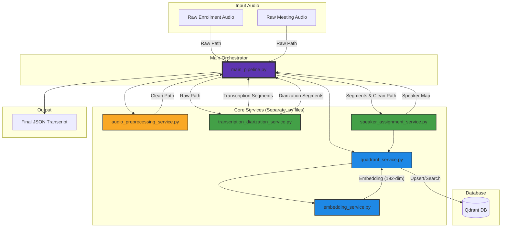
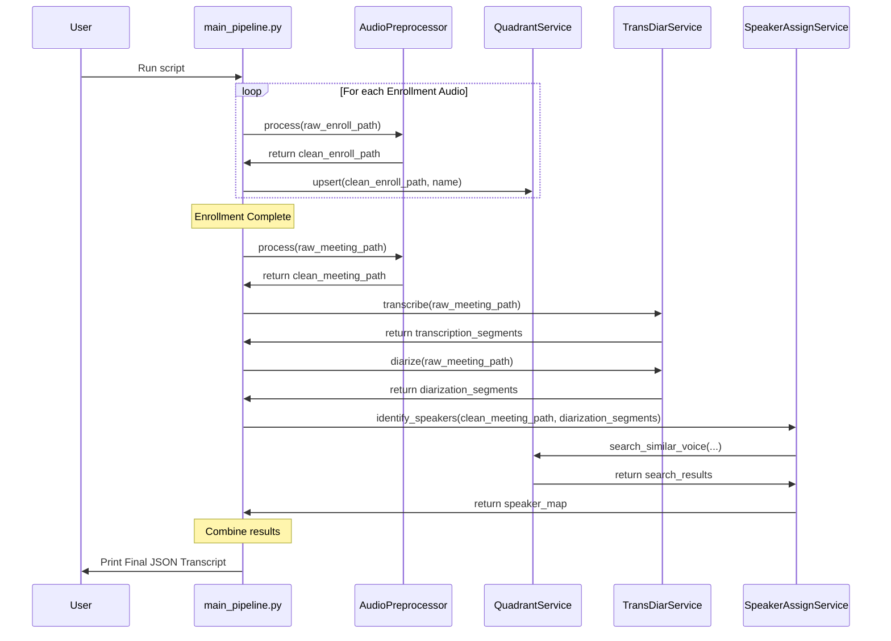

# VoxScribe: Multi-speaker Transcription and Identification

This project provides a complete Python pipeline for processing multi-speaker audio. It performs transcription, speaker diarization, and speaker identification against a database of enrolled voices to produce a final, name-tagged transcript.

## Features

-   **Audio Pre-processing:** Cleans audio by reducing noise and normalizing loudness.
-   **Speaker Enrollment:** Creates and stores unique voiceprints for known speakers in a Qdrant vector database.
-   **Transcription:** Converts speech to text with timestamps using `faster-whisper`.
-   **Speaker Diarization:** Identifies who spoke when, assigning anonymous speaker labels using `pyannote.audio`.
-   **Speaker Identification:** Matches anonymous speakers to enrolled speakers using a state-of-the-art **SpeechBrain** model.
-   **Modular Design:** Built with a clean, service-oriented architecture for maintainability and testing.

## System Architecture

The pipeline is composed of several distinct services that work together, orchestrated by `main_pipeline.py`.



## Prerequisites
- Python 3.10+
- A Hugging Face account and access token

## Setup & Installation

### Clone the Repository:

```Bash
git clone <your-repo-url>
cd <your-repo-name>
```

### Create and Activate a Virtual Environment

```Bash
# Create the virtual environment
python -m venv .venv

# Activate it (Linux/macOS)
source .venv/bin/activate

# Or activate it (Windows)
.\.venv\Scripts\activate
```

### Install Dependencies:

```Bash
pip install -r requirements.txt
```

### Configure Environment

Create a .env file by copying the example template. Then, fill in your secret credentials.

```bash
cp .env.example .env
# Now, edit the .env file with your tokens
```

### Run Qdrant Locally

If you are not using a managed service, you will need to run a local Qdrant instance. For development, you can create a temporary, in-memory instance by modifying the Quadrant_service:

```
# In quadrant_service.py, for a purely local instance:
from qdrant_client import QdrantClient
# self.client = QdrantClient(url=self.QDRANT_URL, api_key=self.QDRANT_API_KEY)
self.client = QdrantClient(":memory:") # Creates a temporary, in-memory instance
```

## Usage
1. Place Your Audio Files: Put your enrollment audio files (e.g., audio_guru.wav) and your meeting audio file (audio_meeting_test_1.wav) in the root directory.

1. Run the Main Pipeline: Execute the main_pipeline.py script.

```
python main_pipeline.py
```

The script will process the files and print the final, name-tagged JSON transcript to the console.

## Sequence of Operations
The following diagram illustrates the step-by-step process of enrolling speakers and processing a meeting.


